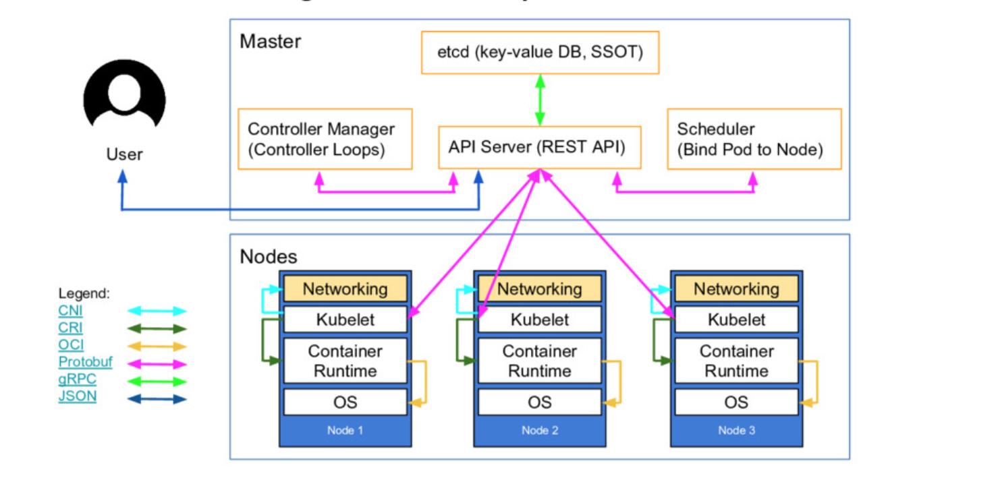

## Kubernetes Control Plane'in Oluşturulması

Şimdiye kadar controlplane bileşenlerinden  sadece etcd kurmuş olduk. Bu bölümde Kubernetes API server, schedular ve controller manager'ı kuruyor olacağız.

Kurulumumuz bittikten sonra  Kubelet Authorization için RBAC tanımı yapacağız. Amacımız Kubernetes API sunucularının kubelet API'lerine erişmesini sağlamak. Kubelet üzerinde metrikleri, günlükleri almak ve pod'larda komut çalıştırmak için Kubelet API'sine erişebilmek gerekiyor.



Kaynak: Kubernetes Architecture by [Lucas Käldström](https://speakerdeck.com/luxas/kubeadm-cluster-creation-internals-from-self-hosting-to-upgradability-and-ha).


**UYARI:** Buradaki komutların bütün controller makinalarında çalıştırılması gerekiyor.


Öncelikle binary'leri indiriyoruz.

```shell
cd ~/kubernetes

wget -q --show-progress --https-only --timestamping \
  "https://storage.googleapis.com/kubernetes-release/release/v1.21.0/bin/linux/amd64/kube-apiserver" \
  "https://storage.googleapis.com/kubernetes-release/release/v1.21.0/bin/linux/amd64/kube-controller-manager" \
  "https://storage.googleapis.com/kubernetes-release/release/v1.21.0/bin/linux/amd64/kube-scheduler" \
  "https://storage.googleapis.com/kubernetes-release/release/v1.21.0/bin/linux/amd64/kubectl"

```
daha sonra kubernetes binary'lerini taşıyoruz.

```
chmod +x kube-apiserver kube-controller-manager kube-scheduler kubectl
sudo mv kube-apiserver kube-controller-manager kube-scheduler kubectl /usr/local/bin/
```
### Kubernetes API Servisinin Konfigürasyonu

**UYARI:** Buradaki komutlar bütün controller makinalarında çalıştırılmalıdır.

Sertifikaların ve config doyalarının taşıyoruz.
```
sudo mkdir -p /var/lib/kubernetes/

sudo mv ca.pem ca-key.pem kubernetes-key.pem kubernetes.pem \
    service-account-key.pem service-account.pem \
    encryption-config.yaml /var/lib/kubernetes/

```

KUBERNETES_PUBLIC_ADDRESS parametresindeki ip adresi load balancer'larımızın kullandığı virtual ip adresimiz.

Systemd dosyasında "--authorization-mode=Node,RBAC" kısmında ki webhook opsiyonu authotizaiton'ın REST API üzerinden yönetilebileğini söylüyor. Authorization hakkında daha fazla bilgi almak için [şu sayfayı](https://kubernetes.io/docs/reference/access-authn-authz/authorization/#checking-api-access) ziyaret ediniz.


Role-based access control (RBAC) ve diğer authorization teknikleri hakkında detaylı bilgiyi [Kubernetes resmi sayfasından](https://kubernetes.io/docs/reference/access-authn-authz/authorization/#using-flags-for-your-authorization-module
) edinebilsiniz.


```shell
KUBERNETES_PUBLIC_ADDRESS=10.240.10.10

ETCD_NAME=$(hostname -s)

INTERNAL_IP=

CONTROLLERS_ADDRESSES=(controller-01,10.240.10.4 controller-02,10.240.10.5 controller-03,10.240.10.6)

ETCD_SERVERS=

ETCD_PORT=2379

for i in "${CONTROLLERS_ADDRESSES[@]}" ; do 
  KEY=${i%,*};
  VAL=${i#*,};
  echo $KEY" - "$VAL;
  ETCD_SERVERS=${ETCD_SERVERS},https://"$VAL":"$ETCD_PORT;

  if [ $KEY == $ETCD_NAME ]; then INTERNAL_IP=$VAL; fi
done

ETCD_SERVERS=${ETCD_SERVERS:1}

echo $ETCD_SERVERS
echo $INTERNAL_IP
echo $ETCD_NAME

cat <<EOF | sudo tee /etc/systemd/system/kube-apiserver.service
[Unit]
Description=Kubernetes API Server
Documentation=https://github.com/kubernetes/kubernetes

[Service]
ExecStart=/usr/local/bin/kube-apiserver \
  --advertise-address=${INTERNAL_IP} \
  --allow-privileged=true \
  --apiserver-count=3 \
  --audit-log-maxage=30 \
  --audit-log-maxbackup=3 \
  --audit-log-maxsize=100 \
  --audit-log-path=/var/log/audit.log \
  --authorization-mode=Node,RBAC \
  --bind-address=0.0.0.0 \
  --client-ca-file=/var/lib/kubernetes/ca.pem \
  --enable-admission-plugins=NamespaceLifecycle,NodeRestriction,LimitRanger,ServiceAccount,DefaultStorageClass,ResourceQuota \
  --etcd-cafile=/var/lib/kubernetes/ca.pem \
  --etcd-certfile=/var/lib/kubernetes/kubernetes.pem \
  --etcd-keyfile=/var/lib/kubernetes/kubernetes-key.pem \
  --etcd-servers=${ETCD_SERVERS} \
  --event-ttl=1h \
  --encryption-provider-config=/var/lib/kubernetes/encryption-config.yaml \
  --kubelet-certificate-authority=/var/lib/kubernetes/ca.pem \
  --kubelet-client-certificate=/var/lib/kubernetes/kubernetes.pem \
  --kubelet-client-key=/var/lib/kubernetes/kubernetes-key.pem \
  --runtime-config='api/all=true' \
  --service-account-key-file=/var/lib/kubernetes/service-account.pem \
  --service-account-signing-key-file=/var/lib/kubernetes/service-account-key.pem \
  --service-account-issuer=https://${KUBERNETES_PUBLIC_ADDRESS}:6443 \
  --service-cluster-ip-range=10.32.0.0/24 \
  --service-node-port-range=30000-32767 \
  --tls-cert-file=/var/lib/kubernetes/kubernetes.pem \
  --tls-private-key-file=/var/lib/kubernetes/kubernetes-key.pem \
  --v=2
Restart=on-failure
RestartSec=5

[Install]
WantedBy=multi-user.target
EOF

cat /etc/systemd/system/kube-apiserver.service
```


Örnek olarak controller-01'in systemd dosyayı şu şekilde olmalıdır.

```
cat /etc/systemd/system/kube-apiserver.service

[Unit]
Description=Kubernetes API Server
Documentation=https://github.com/kubernetes/kubernetes

[Service]
ExecStart=/usr/local/bin/kube-apiserver \
  --advertise-address=10.240.10.4 \
  --allow-privileged=true \
  --apiserver-count=3 \
  --audit-log-maxage=30 \
  --audit-log-maxbackup=3 \
  --audit-log-maxsize=100 \
  --audit-log-path=/var/log/audit.log \
  --authorization-mode=Node,RBAC \
  --bind-address=0.0.0.0 \
  --client-ca-file=/var/lib/kubernetes/ca.pem \
  --enable-admission-plugins=NamespaceLifecycle,NodeRestriction,LimitRanger,ServiceAccount,DefaultStorageClass,ResourceQuota \
  --etcd-cafile=/var/lib/kubernetes/ca.pem \
  --etcd-certfile=/var/lib/kubernetes/kubernetes.pem \
  --etcd-keyfile=/var/lib/kubernetes/kubernetes-key.pem \
  --etcd-servers=https://10.240.10.4:2379,https://10.240.10.5:2379,https://10.240.10.6:2379 \
  --event-ttl=1h \
  --encryption-provider-config=/var/lib/kubernetes/encryption-config.yaml \
  --kubelet-certificate-authority=/var/lib/kubernetes/ca.pem \
  --kubelet-client-certificate=/var/lib/kubernetes/kubernetes.pem \
  --kubelet-client-key=/var/lib/kubernetes/kubernetes-key.pem \
  --runtime-config='api/all=true' \
  --service-account-key-file=/var/lib/kubernetes/service-account.pem \
  --service-account-signing-key-file=/var/lib/kubernetes/service-account-key.pem \
  --service-account-issuer=https://10.240.10.10:6443 \
  --service-cluster-ip-range=10.32.0.0/24 \
  --service-node-port-range=30000-32767 \
  --tls-cert-file=/var/lib/kubernetes/kubernetes.pem \
  --tls-private-key-file=/var/lib/kubernetes/kubernetes-key.pem \
  --v=2
Restart=on-failure
RestartSec=5

[Install]
WantedBy=multi-user.target
```

### Controller Manager Konfigürasyonu

**UYARI:** Buradaki komutlar bütün controller makinalarında çalıştırılmalıdır.

```shell
sudo mv kube-controller-manager.kubeconfig /var/lib/kubernetes/


cat <<EOF | sudo tee /etc/systemd/system/kube-controller-manager.service
[Unit]
Description=Kubernetes Controller Manager
Documentation=https://github.com/kubernetes/kubernetes

[Service]
ExecStart=/usr/local/bin/kube-controller-manager \
  --bind-address=0.0.0.0 \
  --cluster-cidr=10.200.0.0/16 \
  --cluster-name=kubernetes \
  --cluster-signing-cert-file=/var/lib/kubernetes/ca.pem \
  --cluster-signing-key-file=/var/lib/kubernetes/ca-key.pem \
  --kubeconfig=/var/lib/kubernetes/kube-controller-manager.kubeconfig \
  --leader-elect=true \
  --root-ca-file=/var/lib/kubernetes/ca.pem \
  --service-account-private-key-file=/var/lib/kubernetes/service-account-key.pem \
  --service-cluster-ip-range=10.32.0.0/24 \
  --use-service-account-credentials=true \
  --v=2
Restart=on-failure
RestartSec=5

[Install]
WantedBy=multi-user.target
EOF


```

### Scheduler Konfigürasyonu

kubeconfig dosyamızı taşıyoruz ve ardından kube-scheduler.yaml dosyamızı oluşturuyoruz.

**UYARI:** Buradaki komutlar bütün controller makinalarında çalıştırılmalıdır.


```
sudo mv kube-scheduler.kubeconfig /var/lib/kubernetes/

sudo mkdir -p /etc/kubernetes/config/

cat <<EOF | sudo tee /etc/kubernetes/config/kube-scheduler.yaml
apiVersion: kubescheduler.config.k8s.io/v1beta1
kind: KubeSchedulerConfiguration
clientConnection:
  kubeconfig: "/var/lib/kubernetes/kube-scheduler.kubeconfig"
leaderElection:
  leaderElect: true
EOF
```
systemd servis dosyasımızı oluşturuyoruz.

```shell
cat <<EOF | sudo tee /etc/systemd/system/kube-scheduler.service
[Unit]
Description=Kubernetes Scheduler
Documentation=https://github.com/kubernetes/kubernetes

[Service]
ExecStart=/usr/local/bin/kube-scheduler \
  --config=/etc/kubernetes/config/kube-scheduler.yaml \
  --v=2
Restart=on-failure
RestartSec=5

[Install]
WantedBy=multi-user.target
EOF
```

### Controller Servislerimizi Başlatıyoruz

**UYARI:** Buradaki komutlar bütün controller makinalarında çalıştırılmalıdır.

```shell
sudo systemctl daemon-reload
sudo systemctl enable kube-apiserver kube-controller-manager kube-scheduler
sudo systemctl start kube-apiserver kube-controller-manager kube-scheduler
```

Kubetnetes API servisimizin çalıştığını test etmek için kontroller makinalarından herhangi birinde alttaki komutu çalıştırıyoruz.

```shell
kubectl cluster-info --kubeconfig admin.kubeconfig

# sonuç
Kubernetes control plane is running at https://127.0.0.1:6443
```

- UYARI: Eğer service-account-issuer flag ile ilgili problem yaşarsanız [şu linki](https://github.com/kelseyhightower/kubernetes-the-hard-way/issues/626) takip ediniz. Servisi test ettiğinizde çalışmadığını görürseniz alttaki komutla daha fazla bilgi alabilirsiniz.


```shell
kubectl cluster-info dump --kubeconfig admin.kubeconfig
```

### Http (80 Portu ÜZerinden) Health Check Çalıştırmak

Burada yaptığımız kurguda gerek yok ancak eğer onprem veya cloud üzerinden kullandığınız load balancer sadece http health check yapabiliyorsa Kubernetes API sunucularında 80 portu üzerinden health check yapılmasını sağlamak durumunda kalabilirsiniz.

Bunun için bütün controller makinlarında alttaki kurulumları ve konfigürasyonları yapmalısınız. Nginx proxy kurarak http üzerinden aldığımız isteği Kubernetes API'sine https olarak yönlendieiyoruz ve gelen sonucu da tekrar client'a http üzerinden gönderiyoruz. 


```shell
sudo apt-get update

sudo apt-get install -y nginx

cat > kubernetes.default.svc.cluster.local <<EOF
server {
  listen      80;
  server_name kubernetes.default.svc.cluster.local;

  location /healthz {
     proxy_pass                    https://127.0.0.1:6443/healthz;
     proxy_ssl_trusted_certificate /var/lib/kubernetes/ca.pem;
  }
}
EOF
{
  sudo mv kubernetes.default.svc.cluster.local \
    /etc/nginx/sites-available/kubernetes.default.svc.cluster.local

  sudo ln -s /etc/nginx/sites-available/kubernetes.default.svc.cluster.local /etc/nginx/sites-enabled/
}

sudo systemctl restart nginx

sudo systemctl enable nginx

```

Daha sonra alttaki komutla kontrol edebilirsiniz

```shell
curl -H "Host: kubernetes.default.svc.cluster.local" -i http://127.0.0.1/healthz


HTTP/1.1 200 OK
Server: nginx/1.18.0 (Ubuntu)
Date: Sun, 14 May 2021 04:19:29 GMT
Content-Type: text/plain; charset=utf-8
Content-Length: 2
Connection: keep-alive
Cache-Control: no-cache, private
X-Content-Type-Options: nosniff
X-Kubernetes-Pf-Flowschema-Uid: c43f32eb-e038-457f-9474-571d43e5c325
X-Kubernetes-Pf-Prioritylevel-Uid: 8ba5908f-5569-4330-80fd-c643e7512366

ok

```

### Kubelet Authorization İçin RBAC Tanımlaması

Amacımız Kubernetes API sunucularının kubelet API'lerine erişmesini sağlamak. Kubelet üzerinde metrikleri, günlükleri almak ve pod'larda komut çalıştırmak için Kubelet API'sine erişebilmek gerekiyor.

**UYARI:** Komutları herhangi bir controller makinasında çalıştırmanız yeterli çünkü Kubernetes üzernde apply edeceğimiz bu dosyalar bütün cluster'ı etkileyecek. 

Kubernets API sunucusunun Kubelet API'sıne erşimi için [ClusterRole](https://kubernetes.io/docs/reference/access-authn-authz/rbac/#role-and-clusterrole) oluşturuyoruz. 


Aşağıdaki komutu contoroller-01 üzerinde çalıştıyoruz.

```
cd ~/home/ubuntu
```

Kubernetes kullanıcısını yukarıda oluşturduğumuz ClusterRole ile ClusterRoleBinding yarımıyla yetkilendiriyoruz.

```shell
cat <<EOF | kubectl apply --kubeconfig admin.kubeconfig -f -
apiVersion: rbac.authorization.k8s.io/v1
kind: ClusterRoleBinding
metadata:
  name: system:kube-apiserver
  namespace: ""
roleRef:
  apiGroup: rbac.authorization.k8s.io
  kind: ClusterRole
  name: system:kube-apiserver-to-kubelet
subjects:
  - apiGroup: rbac.authorization.k8s.io
    kind: User
    name: kubernetes
EOF

```

- [Giriş ve Lab Ortamının Kurulması](1.Giris.md)
  - [LXD ile Lab Ortamı Kurulumu](2.LXD-Lab.md)
  - [KVM-Qemu İle Lab Ortamı Kurulumu](3.KVM-Qemu-Lab.md)
  - [Vagrant-Libvirt ile Lab Ortamı Kurulumu](4.Vagrant-Libvirt-Lab.md)
  - [Vagrant-Virtualbox ile Lab Ortamı Kurulumu](5.Vagrant-Virtualbox-Lab.md)
- [İstemci Araçlarının Kurulumu](6.Host-Client-Tools.md)
- [Harici Yük Dengeleyici Kurulumu](7.External-LB.md)
- [Certificate Authority ve TLS Sertifikalarının Oluşturulması](8.CA-TLS.md)
- [Kubeconfig Dosyalarının Oluşturulması](9.Kubeconfig.md)
- [Data Encryption Config ve Key Oluşturulması](10.Data-Encryption.md)
- [Etcd Cluster Kurulumu](11.ETCD.md)
- [Control Plane'nin Kurulumu ve Konfigürasyonu](12.Control-Plane.md)
- [Worker Node'ların Kurulumu ve Konfigürasyonu](13.Worker-Node.md)
- [Uzak Bağlantı için Kubectl Konfigürasyonu](14.Kubectl.md)
- [Pod Network Route'larının Ayarlanması](14.Pod-Network.md)
- [DNS'in Kurulumu ve Konfigürasyonu](15.DNS-Addon.md)
- [Smoke Test](16.Smoke-Test.md) 