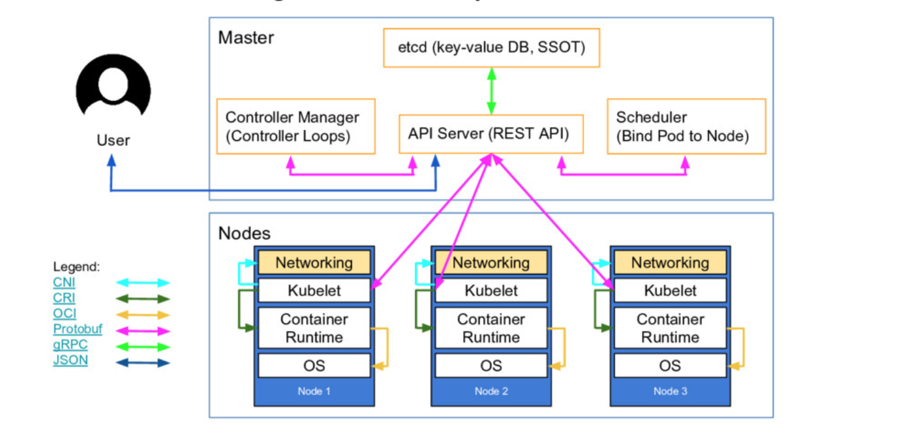
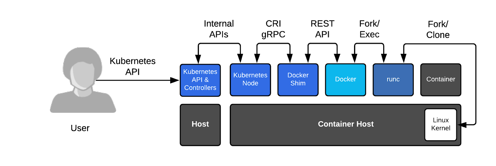
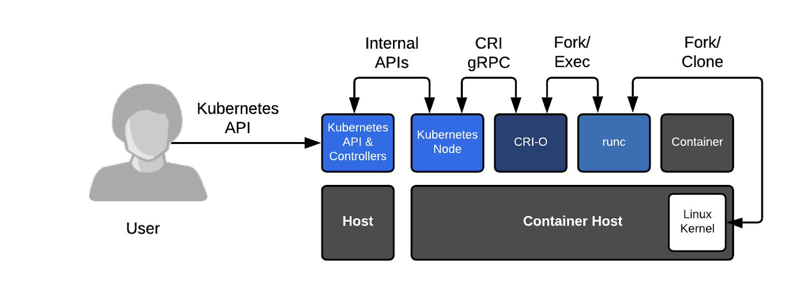

## Kubernetes Worker Node'larının Oluşturulması

Bu bölümde runc, gVisor, containerd, kubelet ve kube-proxy bileşenlerini bütün worker node'lara kuruyor olacağız.


**UYARI:** aşağıdaki komut ve konfigürasyonlar bütün worker node'larda çalıştırılmalıdır.

Öncelikle woker node'lardaki bağımlılıkları yüklüyoruz.

```
sudo apt-get update
sudo apt-get -y install socat conntrack ipset
```
- socart: Firewall'a ihtiyaç duymaksızın port forward yapmak için (de) kullanılır. Kubernetes de ise _kubectl port-forward_ komutu çalıştırıldığında ihtiyaç duyurulur.
- conntrack: Netfilter üzerindeki network bağlantılarını takip etmek için kullanılır.
- ipset: Iptables üzerinde toplu olarak kural tanımlamada kullanılır. Bir grup ip adresine toplu işlem yapmak için kullanılır.

Bütün worker makinlarımızda swap'ı disabled yapıyoruz. Çünkü Kubelet swap enabled iken çalışamıyor. Bu nedenle LXC instance'larımız için oluşturduğumuz profile dosyamızda _limits.memory.swap: "false"_ bölümünü eklemiştik.

Aşağıdaki komutu çalıştırdığımızda ekran hiçbirşey gelmiyorsa swap kapalıdır.

```
sudo swapon --show

NAME TYPE    SIZE USED PRIO
none virtual 1.9G   0B    0
```


Eğer ekranda yukarıdaki gibi birşeyler geldiyse aşağıdaki komutu kullanıyoruz. Ancak bu komut yeterli olmayabilir. Kullandığınız Linux sürümüne göre sisteminizde farklı yerlerde de swap ile ilgili ayar olabilir kontrol etmeyi unutmayınız. Ayrıca sisteminiz yeni başlatıldığında da  swap'ı disabled olduğunda emin olunuz.

```
sudo swapoff -a
```
Binary'lerimizi indiriyoruz.

```
wget -q --show-progress --https-only --timestamping \
  https://github.com/kubernetes-sigs/cri-tools/releases/download/v1.21.0/crictl-v1.21.0-linux-amd64.tar.gz \
  https://github.com/opencontainers/runc/releases/download/v1.0.0-rc93/runc.amd64 \
  https://github.com/containernetworking/plugins/releases/download/v0.9.1/cni-plugins-linux-amd64-v0.9.1.tgz \
  https://github.com/containerd/containerd/releases/download/v1.4.4/containerd-1.4.4-linux-amd64.tar.gz \
  https://storage.googleapis.com/kubernetes-release/release/v1.21.0/bin/linux/amd64/kubectl \
  https://storage.googleapis.com/kubernetes-release/release/v1.21.0/bin/linux/amd64/kube-proxy \
  https://storage.googleapis.com/kubernetes-release/release/v1.21.0/bin/linux/amd64/kubelet
```

Daha sonra kurulum yapılacak klasörleri oluşturuyoruz. hata


```
sudo mkdir -p \
  /etc/cni/net.d \
  /opt/cni/bin \
  /var/lib/kubelet \
  /var/lib/kube-proxy \
  /var/lib/kubernetes \
  /var/run/kubernetes
```

Binary'leri yüklüyoruz.

```
mkdir containerd
 tar -xvf crictl-v1.21.0-linux-amd64.tar.gz
 tar -xvf containerd-1.4.4-linux-amd64.tar.gz -C containerd
 sudo tar -xvf cni-plugins-linux-amd64-v0.9.1.tgz -C /opt/cni/bin/
 sudo mv runc.amd64 runc
 chmod +x crictl kubectl kube-proxy kubelet runc 
 sudo mv crictl kubectl kube-proxy kubelet runc /usr/local/bin/
 sudo mv containerd/bin/* /bin/
```

Devam etmeden önce docker ve containerd arasındaki ilişkiye deyinmek istiyorum. Bildiğiniz üzere Kubernetes Docker'ı desteklememeyeceğini [açıklamıştı](https://kubernetes.io/blog/2020/12/02/dockershim-faq/).

Docker ın kubernetes üzerindeki en önemli yükü dockerd nin doğrudan CRI(container runtime iterface) için yazılmamış olması. bu nedenle Kubernetes uzunca bir süre Docker'ı desteklemek amacıyla dockershim aracını geliştiriyordu.

Aşağıda CRI yeşil renkli oklarla gösteriliyor.


Kaynak: Kubernetes Architecture by [Lucas Käldström](https://speakerdeck.com/luxas/kubeadm-cluster-creation-internals-from-self-hosting-to-upgradability-and-ha).

Kubernetes aslında bu dockershim aracını desteklemeyi bıraktı. Aşağıdaki CRI-O yerine containerd de kullanılabilir. Hatta containerd docker ile birlikte sisteme kuruluyor zaten.




[Kaynak: OpenShift](https://www.openshift.com/blog/kubernetes-is-removing-docker-support-kubernetes-is-not-removing-docker-support)

### CNI Network Ayarlarının Yapılması


Pod'ların alabilcekleri IP aralıklarını her node için farklı olacak şekilde konfigüre ediyoruz.

```shell
POD_CIDR_LIST=(worker-01,10.10.1.0/24 worker-02,10.10.2.0/24 worker-03,10.10.3.0/24)


POD_CIDR=

HOSTNAME=$(hostname -s)

for i in "${POD_CIDR_LIST[@]}" ; do 
  KEY=${i%,*};
  VAL=${i#*,};
  echo $KEY" - "$VAL;
  if [ $KEY == $HOSTNAME ]; then POD_CIDR=$VAL; fi
done

echo $POD_CIDR


cat <<EOF | sudo tee /etc/cni/net.d/10-bridge.conf
{
    "cniVersion": "0.4.0",
    "name": "bridge",
    "type": "bridge",
    "bridge": "cnio0",
    "isGateway": true,
    "ipMasq": true,
    "ipam": {
        "type": "host-local",
        "ranges": [
          [{"subnet": "${POD_CIDR}"}]
        ],
        "routes": [{"dst": "0.0.0.0/0"}]
    }
}
EOF

```

Örneğin worker-01 için oluşan network config dosyamız şu şekilde olmalıdır.

```shell
cat /etc/cni/net.d/10-bridge.conf
{
    "cniVersion": "0.4.0",
    "name": "bridge",
    "type": "bridge",
    "bridge": "cnio0",
    "isGateway": true,
    "ipMasq": true,
    "ipam": {
        "type": "host-local",
        "ranges": [
          [{"subnet": "10.10.1.0/24"}]
        ],
        "routes": [{"dst": "0.0.0.0/0"}]
    }
}
```
CNI için loopback konfigürasyon dosyası:

```shell
cat <<EOF | sudo tee /etc/cni/net.d/99-loopback.conf
{
    "cniVersion": "0.4.0",
    "name": "lo",
    "type": "loopback"
}
EOF

```

### Containerd Konfigürasyonu

```shell
sudo mkdir -p /etc/containerd/

cat << EOF | sudo tee /etc/containerd/config.toml
[plugins]
  [plugins.cri.containerd]
    snapshotter = "overlayfs"
    [plugins.cri.containerd.default_runtime]
      runtime_type = "io.containerd.runtime.v1.linux"
      runtime_engine = "/usr/local/bin/runc"
      runtime_root = ""
EOF

```


Containerd için systemd dosyasını oluşturuyoruz.

**UYARI:** Ancak burada çok dikkat edilmesi gereken bir konu var. Eğer LXC üzerinde çalışıyorsanız containerd servisi için yazılan systemd dosyasındaki şu alanda _ExecStartPre=-/sbin/modprobe overlay_  yer alan eşittirden sonraki çizgiyi eklemelisiniz. Eğer LXC kullanmıyorsanız silmelisiniz. Yada şu şekilde _ExecStartPre=_ boş bırakabilirsiniz. LXC Profile oluştururken overlay modülünü zaten yüklüyoruz. Konu ile ilgili uzun süredik açık olan Github'daki [şu issue'yu](https://github.com/docker/for-linux/issues/475) takip edebilirsiniz.


```shell
cat <<EOF | sudo tee /etc/systemd/system/containerd.service
[Unit]
Description=containerd container runtime
Documentation=https://containerd.io
After=network.target

[Service]
ExecStartPre=-/sbin/modprobe overlay
ExecStart=/bin/containerd
Restart=always
RestartSec=5
Delegate=yes
KillMode=process
OOMScoreAdjust=-999
LimitNOFILE=1048576
LimitNPROC=infinity
LimitCORE=infinity

[Install]
WantedBy=multi-user.target
EOF
```

### Kubelet Konfigürasyonu

```shell

cd /home/ubuntu/

HOSTNAME=$(hostname -s)

sudo mv ${HOSTNAME}-key.pem ${HOSTNAME}.pem /var/lib/kubelet/
sudo mv ${HOSTNAME}.kubeconfig /var/lib/kubelet/kubeconfig
sudo mv ca.pem /var/lib/kubernetes/
```


kubelet-config.yaml dosyası da aşağıdaki gibidir. Burada dikkat edilecek önemli konu CoreDNS in service discovery yaparken loop'a düşmemesi için _resolvConf: "/run/systemd/resolve/resolv.conf"_ ayarı systemd-resolved'un seçilmesidir.


```shell
cat <<EOF | sudo tee /var/lib/kubelet/kubelet-config.yaml
kind: KubeletConfiguration
apiVersion: kubelet.config.k8s.io/v1beta1
authentication:
  anonymous:
    enabled: false
  webhook:
    enabled: true
  x509:
    clientCAFile: "/var/lib/kubernetes/ca.pem"
authorization:
  mode: Webhook
clusterDomain: "cluster.local"
clusterDNS:
  - "10.32.0.10"
podCIDR: "${POD_CIDR}"
resolvConf: "/run/systemd/resolve/resolv.conf"
runtimeRequestTimeout: "15m"
tlsCertFile: "/var/lib/kubelet/${HOSTNAME}.pem"
tlsPrivateKeyFile: "/var/lib/kubelet/${HOSTNAME}-key.pem"
EOF

```

Kubelet servisi için systemd dosyasını oluşturuyoruz.

```shell
cat <<EOF |  sudo tee /etc/systemd/system/kubelet.service
[Unit]
Description=Kubernetes Kubelet
Documentation=https://github.com/kubernetes/kubernetes
After=containerd.service
Requires=containerd.service

[Service]
ExecStart=/usr/local/bin/kubelet \
  --config=/var/lib/kubelet/kubelet-config.yaml \
  --container-runtime=remote \
  --container-runtime-endpoint=unix:///var/run/containerd/containerd.sock \
  --image-pull-progress-deadline=2m \
  --kubeconfig=/var/lib/kubelet/kubeconfig \
  --network-plugin=cni \
  --register-node=true \
  --v=2
Restart=on-failure
RestartSec=5

[Install]
WantedBy=multi-user.target
EOF
```

**UYARI:** Servisleri çalıştırdığınızda "readonly permission denied" hataları alacak olursanız aşağıdaki linkleri takip ediniz.

- https://github.com/kubernetes-sigs/kind/issues/662
- https://github.com/kubernetes-sigs/kind/pull/664
- https://github.com/corneliusweig/kubernetes-lxd
- https://github.com/lxc/lxd/issues/714
- https://ubuntu.com/blog/mounting-your-home-directory-in-lxd
- https://jasonplayne.com/linux/mounting-a-folder-from-the-host-inside-an-lxc-container
- https://microk8s.io/docs/lxd


### Kubernetes Proxy Konfigürasyonu

Kubeconfig dosyasını taşıyıp kube-proxy-config.yaml dosyasını oluşturuyoruz.

```shell
cd /home/ubuntu

sudo mv kube-proxy.kubeconfig /var/lib/kube-proxy/kubeconfig


cat <<EOF | sudo tee /var/lib/kube-proxy/kube-proxy-config.yaml
kind: KubeProxyConfiguration
apiVersion: kubeproxy.config.k8s.io/v1alpha1
clientConnection:
  kubeconfig: "/var/lib/kube-proxy/kubeconfig"
mode: "iptables"
clusterCIDR: "10.10.0.0/16"
EOF

```

Kube-proxy için systemd dosyasını oluşturuyoruz.

```shell
cat <<EOF | sudo tee /etc/systemd/system/kube-proxy.service
[Unit]
Description=Kubernetes Kube Proxy
Documentation=https://github.com/kubernetes/kubernetes

[Service]
ExecStart=/usr/local/bin/kube-proxy \\
  --config=/var/lib/kube-proxy/kube-proxy-config.yaml
Restart=on-failure
RestartSec=5

[Install]
WantedBy=multi-user.target
EOF
```

### Worker Node Üzerideki Uygulamaların/Servislerin Başlatılması

```shell
sudo systemctl daemon-reload
sudo systemctl enable containerd kubelet kube-proxy
sudo systemctl start containerd kubelet kube-proxy
```

Doğrulama için controller maskinlarımızdan birinde alttaki komutu çalıştırıyoruz. Sonuç olarak 3 adet worker node un çalıştığını görebiliriz.
```
kubectl get nodes --kubeconfig admin.kubeconfig

# sonuç

NAME        STATUS   ROLES    AGE   VERSION
worker-01   Ready    <none>   11h   v1.21.0
worker-02   Ready    <none>   11h   v1.21.0
worker-03   Ready    <none>   11h   v1.21.0

```

- [Giriş ve Lab Ortamının Kurulması](1.Giris.md)
  - [LXD ile Lab Ortamı Kurulumu](2.LXD-Lab.md)
  - [KVM-Qemu İle Lab Ortamı Kurulumu](3.KVM-Qemu-Lab.md)
  - [Vagrant-Libvirt ile Lab Ortamı Kurulumu](4.Vagrant-Libvirt-Lab.md)
  - [Vagrant-Virtualbox ile Lab Ortamı Kurulumu](5.Vagrant-Virtualbox-Lab.md)
- [İstemci Araçlarının Kurulumu](6.Host-Client-Tools.md)
- [Harici Yük Dengeleyici Kurulumu](7.External-LB.md)
- [Certificate Authority ve TLS Sertifikalarının Oluşturulması](8.CA-TLS.md)
- [Kubeconfig Dosyalarının Oluşturulması](9.Kubeconfig.md)
- [Data Encryption Config ve Key Oluşturulması](10.Data-Encryption.md)
- [Etcd Cluster Kurulumu](11.ETCD.md)
- [Control Plane'nin Kurulumu ve Konfigürasyonu](12.Control-Plane.md)
- [Worker Node'ların Kurulumu ve Konfigürasyonu](13.Worker-Node.md)
- [Uzak Bağlantı için Kubectl Konfigürasyonu](14.Kubectl.md)
- [Pod Network Route'larının Ayarlanması](14.Pod-Network.md)
- [DNS'in Kurulumu ve Konfigürasyonu](15.DNS-Addon.md)
- [Smoke Test](16.Smoke-Test.md) 