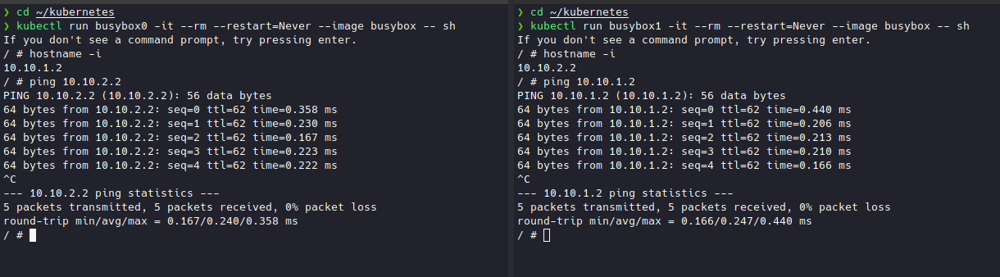

## POD Network Route Ayarlarının Yapılması


Ip bloklarımızı önceki bölümlerde tablodaki gibi yapılandırmştık. Kubernetes network modeline göre Pod'lar bir kısetlama olmaksızın birbirlerine erişebilmelidirler. Bu nedenle worker makinalarımızda routing tablosunun ayalarlanması gerekiyor. 

Konu ile ilgili daha fazla bilgi almak için [Kubernete resmi sayfalarını](https://kubernetes.io/docs/concepts/cluster-administration/networking/#how-to-achieve-this) ziyaret edebilirsiniz.

```
+------------+----------------+----------------+
| Worker     | IP Address     | Pod CIDR       |
+------------+----------------+----------------+
| worker-01  | 10.240.10.7    | 10.10.1.0/24   |
| worker-02  | 10.240.10.8    | 10.10.2.0/24   |
| worker-03  | 10.240.10.9    | 10.10.3.0/24   |
+------------+------------------+----------------+
```
Routing işlemlerimi her worker makinamızda ayrı ayrı yapmamız gerekiyor. Her bir worker node kendi üzerinde bulunun Pod CIDR dışında başka bir subnet'de yeralan pod'u çağıracak olursa nasıl gideceğini bilmelidir.

Örnek olarak worker-01 üzerinde eğer worker-02 üzerindeki bir Pod'u çağıracak olursak o Pod'a erişmenin yolunun worker-01'de 10.240.10.8 ip'si olduğunu worker-01' e belirtmemiz gerekiyor.

yani sırasıyla bütün worker node'larda aşağıkdai komutları çalıştırıyoruz.

```shell
sudo ip route add 10.10.1.0/24 via 10.240.10.7 
sudo ip route add 10.10.2.0/24 via 10.240.10.8
sudo ip route add 10.10.3.0/24 via 10.240.10.9 
```

Test etmek için iki adet busybox image'ını deploy edip birbirlerine ping atıyoruz.


Artık host makinamız üzerinden Kubetnetes API'sine erişebildiğimiz için host makinamız üzerinde alttaki iki satırı farklı terminallerde çalıştırıyoruz.

```shell
# termimal1
kubectl run busybox0 -it --rm --restart=Never --image busybox -- sh

#terminal2
kubectl run busybox1 -it --rm --restart=Never --image busybox -- sh

```

Daha sonra alttaki komutlarla ip adreslerini öğrenip ping atıyoruz.

```shell
# busybox0
hostname -i

# busybox1
ping busybox0_ip_adresi
```




- [Giriş ve Lab Ortamının Kurulması](1.Giris.md)
  - [LXD ile Lab Ortamı Kurulumu](2.LXD-Lab.md)
  - [KVM-Qemu İle Lab Ortamı Kurulumu](3.KVM-Qemu-Lab.md)
  - [Vagrant-Libvirt ile Lab Ortamı Kurulumu](4.Vagrant-Libvirt-Lab.md)
  - [Vagrant-Virtualbox ile Lab Ortamı Kurulumu](5.Vagrant-Virtualbox-Lab.md)
- [İstemci Araçlarının Kurulumu](6.Host-Client-Tools.md)
- [Harici Yük Dengeleyici Kurulumu](7.External-LB.md)
- [Certificate Authority ve TLS Sertifikalarının Oluşturulması](8.CA-TLS.md)
- [Kubeconfig Dosyalarının Oluşturulması](9.Kubeconfig.md)
- [Data Encryption Config ve Key Oluşturulması](10.Data-Encryption.md)
- [Etcd Cluster Kurulumu](11.ETCD.md)
- [Control Plane'nin Kurulumu ve Konfigürasyonu](12.Control-Plane.md)
- [Worker Node'ların Kurulumu ve Konfigürasyonu](13.Worker-Node.md)
- [Uzak Bağlantı için Kubectl Konfigürasyonu](14.Kubectl.md)
- [Pod Network Route'larının Ayarlanması](14.Pod-Network.md)
- [DNS'in Kurulumu ve Konfigürasyonu](15.DNS-Addon.md)
- [Smoke Test](16.Smoke-Test.md) 