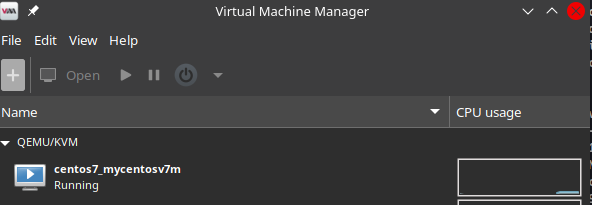
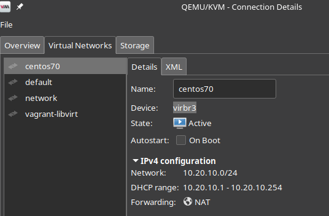
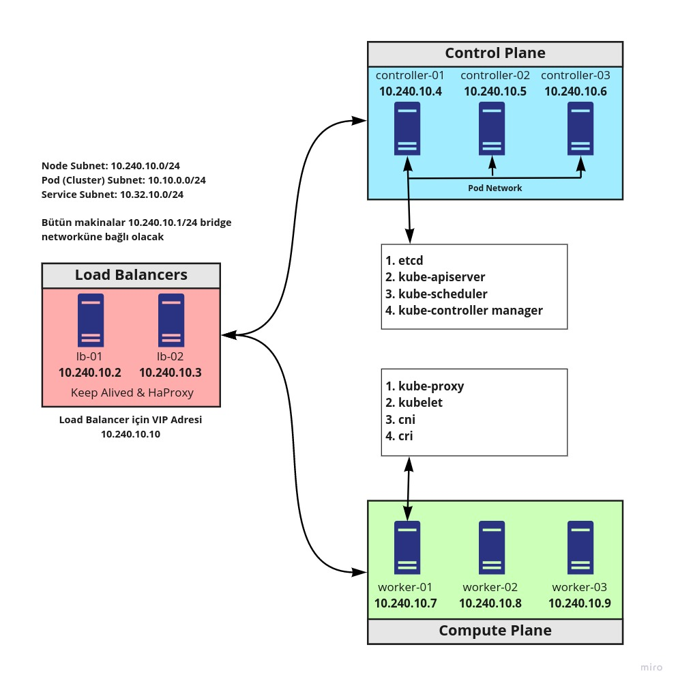

### Vagrant-Libvirt ile Lab Ortamı Kurulumu 

Bu lab ortamı kurulumumuzda Vagrant, provider olarak da libvirt kullanıyor olacağız. 

Öncelikle KVM ve libvirt yüklüyoruz.

```shell
sudo apt install qemu-kvm libvirt-dev \
     libvirt-daemon-system libvirt-clients \
     bridge-utils virtinst virt-manager
```

root hesabıyla çalışmamak için ilgili gruplara kullanıcımızı ekliyoruz.

```shell
sudo usermod -aG libvirt $USER
sudo usermod -aG kvm $USER
```

Şimdi Vagrant'ı kuruyoruz. Diğer sistemlere kurulum için [Vagrant resmi sayfasını](https://www.vagrantup.com/downloads) ziyaret edebilirsiniz

```
curl -fsSL aslında://apt.releases.hashicorp.com/gpg | sudo apt-key add -
sudo apt-add-repository "deb [arch=amd64] https://apt.releases.hashicorp.com $(lsb_release -cs) main"
sudo apt-get update && sudo apt-get install vagrant
```

Daha sonra vagrant-libvirt plugin'ini kuruyoruz.

```
vagrant plugin install vagrant-libvirt
```

**UYARI:** Plugin kurarken https://rubygems.org sayfasına erişememe ile ilgili hata alırsanız alttaki adımları uygulayınız. Detaylar için [şu sayfayı](https://stackoverflow.com/questions/49800432/gem-cannot-access-rubygems-org) ziyaret ediniz.

```
_/etc/gai.conf_ doyasını açıp en alta _"precedence  2a04:4e42::0/32  5"_ satırını tırnakları silip ekleyiniz. Daha sonra network servisini tekrar başlatınız.
```

**UYARI:** eger st.h dosyasının olmadığına dair hata alırsanız aşağıdaki komutu çalıştırınız. Versiyona numaranıza dikkat ediniz.

```
sudo ln -s /opt/vagrant/embedded/include/ruby-3.0.0/ruby/st.h /opt/vagrant/embedded/include/ruby-3.0.0/st.h

```


**UYARI:** Vagrant-libvirt kurulumunda yukarıdaki komutla hata alamya deam ederseniz alttaki komutla da kurmayı deneyebilirsiniz.

```
sudo apt install ruby-libvirt

```

Kuruluma devam ediyoruz makinalara ssh yapabilmek için openSSH kurulumu yapıyoruz.


Ssh servisimizi kontrol ediyoruz.

```
systemctl status sshd
```
Eğer kurulu değilse kuruyoruz.


|Ubuntu için openSSH|Centos için openSSH|
|--------|--------|
|<code>sudo apt-get install openssh-server <br> sudo apt-get install openssh-client <br> sudo systemctl enable ssh<br> sudo systemctl start ssh></code>|<code> sudo yum install openssh-clients <br>sudo yum install openssh-server <br>sudo systemctl enable ssh <br>sudo systemctl start ssh</code>|


Artık ufak bir test yapmaya hazırız.

Öncelikle 2 adet vagrant image'ını indiriyoruz.

```
vagrant box add centos/7 --provider=libvirt
vagrant box add generic/ubuntu2004 --provider=libvirt
```

Daha sonra vagrantfile oluşturuyoruz.

```shell
mkdir -p ~/vagrantvms/centos7 && cd ~/vagrantvms/centos7

cat << EOF > Vagrantfile

# -*- mode: ruby -*-
# vi: set ft=ruby :

ENV['VAGRANT_DEFAULT_PROVIDER'] = 'libvirt'


Vagrant.configure("2") do |config|

  config.vm.define "mycentosv7m" do |config|
  config.vm.hostname = "mycentosv7m"
  config.vm.box = "centos/7"
  config.vm.box_check_update = false
  config.vm.network "private_network", ip: "10.20.10.10"
  config.vm.provider :libvirt do |v|
    v.memory = 1024
    end
  end
end
EOF

vagrant up  

```

VM çalışmya başladığında ssh yapabiliriz.

```
vagrant ssh
```
Ayrıca "Virtual Machine Manager" üzerinden de baktığımızda makinamızın çalıştığını görebiliriz.




Aynı örneği Ubuntu makinamız için de yapıyoruz


```shell
mkdir -p ~/vagrantvms/ubuntu2004 && cd ~/vagrantvms/ubuntu2004

cat << EOF > Vagrantfile

# -*- mode: ruby -*-
# vi: set ft=ruby :

ENV['VAGRANT_DEFAULT_PROVIDER'] = 'libvirt'


Vagrant.configure("2") do |config|

  config.vm.define "myubuntu2004" do |config|
  config.vm.hostname = "myubuntu2004"
  config.vm.box = "generic/ubuntu2004"
  config.vm.box_check_update = false
  config.vm.network "private_network", ip: "10.20.10.11"
  config.vm.provider :libvirt do |v|
    v.memory = 1024
    end
  end
end
EOF

vagrant up  
```

İki VM içinde aynı subnetten ip verdiğimiz için Ubuntu 20.04 makinasının da ilk oluşturduğumuz Centos7 makinası için oluşturulan network'e bağlandığını görebiliriz. 



Makinalar birbirlerini ping'leyebildiğini de test edebilirsiniz.


vagrant-libvirt detayları için [github](https://github.com/vagrant-libvirt/vagrant-libvirt) sayfasını ziyaret edebilirsiniz.

Kubernetes lab ortamımızın topolojisini hatıralayalım.



Aşağıdaki komutları çalıştırarak lab ortamını ayağa kaldırabiliriz.

```shell
mkdir -p ~/kubernetes/vagrantlibvirtlab && cd ~/kubernetes/vagrantlibvirtlab

cat << EOF > Vagrantfile
# -*- mode: ruby -*-
# vi: set ft=ruby :


# centops kurmak isteseniz generic/ubuntu2004 yeine generic/centos8  yazmanız yeterli

# https://github.com/vagrant-libvirt/vagrant-libvirt
ENV['VAGRANT_DEFAULT_PROVIDER'] = 'libvirt'

Vagrant.configure("2") do |config|

# lb-01
config.vm.define "lb-01" do |lb01|
    lb01.vm.box = "generic/ubuntu2004"
    lb01.vm.hostname="lb-01"
    lb01.vm.network "private_network", ip: "10.240.10.2"
    
    lb01.vm.provider :libvirt do |lv|
       lv.memory=2048
       lv.cpus=1
    end 
 end

# lb-02
config.vm.define "lb-02" do |lb02|
    lb02.vm.box = "generic/ubuntu2004"
    lb02.vm.hostname="lb-02"
    lb02.vm.network "private_network", ip: "10.240.10.3"
    
    lb02.vm.provider :libvirt do |lv|
       lv.memory=2048
       lv.cpus=1
    end 
 end


# controller-01
config.vm.define "controller-01" do |controller01|
    controller01.vm.box = "generic/ubuntu2004"
    controller01.vm.hostname="controller-01"
    controller01.vm.network "private_network", ip: "10.240.10.4"
    
    controller01.vm.provider :libvirt do |lv|
       lv.memory=2048
       lv.cpus=1
    end 
 end


# controller-02
config.vm.define "controller-02" do |controller02|
    controller02.vm.box = "generic/ubuntu2004"
    controller02.vm.hostname="controller-02"
    controller02.vm.network "private_network", ip: "10.240.10.5"
    
    controller02.vm.provider :libvirt do |lv|
       lv.memory=2048
       lv.cpus=1
    end 
 end


# controller-03
config.vm.define "controller-03" do |controller03|
    controller03.vm.box = "generic/ubuntu2004"
    controller03.vm.hostname="controller-03"
    controller03.vm.network "private_network", ip: "10.240.10.6"
    
    controller03.vm.provider :libvirt do |lv|
       lv.memory=2048
       lv.cpus=1
    end 
 end


# worker-01
config.vm.define "worker-01" do |worker01|
    worker01.vm.box = "generic/ubuntu2004"
    worker01.vm.hostname="worker-01"
    worker01.vm.network "private_network", ip: "10.240.10.7"
    
    worker01.vm.provider :libvirt do |lv|
       lv.memory=4096
       lv.cpus=2
    end 
 end

 # worker-02
config.vm.define "worker-02" do |worker02|
    worker02.vm.box = "generic/ubuntu2004"
    worker02.vm.hostname="worker-02"
    worker02.vm.network "private_network", ip: "10.240.10.8"
    
    worker02.vm.provider :libvirt do |lv|
       lv.memory=4096
       lv.cpus=2
    end 
 end

 # worker-03
 config.vm.define "worker-03" do |worker03|
    worker03.vm.box = "generic/ubuntu2004"
    worker03.vm.hostname="worker-03"
    worker03.vm.network "private_network", ip: "10.240.10.9"
    
    worker03.vm.provider :libvirt do |lv|
       lv.memory=4096
       lv.cpus=2
    end 
 end

end


EOF

vagrant up
```

**UYARI:** Kurulum yapılırken ekranda aşağıdaki gibi bir hata alacak olursanız ve ekranda takılı kaldıysa bir kaç kez enter'a basınız. Şifre girebileceğiniz alan açılacaktır.

```
This operation requires administrative access. You may skip it by manually adding equivalent entries to the hosts file.
```

Kurulum tamamlandıktan sonra aynı klasörde iken _vagrant ssh controller-02_ komutunu çalıştırarak makinamıza ssh yapabiliriz. Ssh bağlantımızdan sonra diğer makinara ping atarak test edebilirsiniz. Bütün makinlarda bu şekilde test yapıp birbirlerine ping atabildiğimizden amin olmalıyız. 

Kubernetes kurulumlarında da bütün makinalara bu klasörden bu şekilde ssh yapabilirsiniz.

Makinaların tamamını kapatmak için _vagrant halt_ tamamen silmek için _vagrant destroy_ komutunu kullanabilirsiniz.


- [Giriş ve Lab Ortamının Kurulması](1.Giris.md)
  - [LXD ile Lab Ortamı Kurulumu](2.LXD-Lab.md)
  - [KVM-Qemu İle Lab Ortamı Kurulumu](3.KVM-Qemu-Lab.md)
  - [Vagrant-Libvirt ile Lab Ortamı Kurulumu](4.Vagrant-Libvirt-Lab.md)
  - [Vagrant-Virtualbox ile Lab Ortamı Kurulumu](5.Vagrant-Virtualbox-Lab.md)
- [İstemci Araçlarının Kurulumu](6.Host-Client-Tools.md)
- [Harici Yük Dengeleyici Kurulumu](7.External-LB.md)
- [Certificate Authority ve TLS Sertifikalarının Oluşturulması](8.CA-TLS.md)
- [Kubeconfig Dosyalarının Oluşturulması](9.Kubeconfig.md)
- [Data Encryption Config ve Key Oluşturulması](10.Data-Encryption.md)
- [Etcd Cluster Kurulumu](11.ETCD.md)
- [Control Plane'nin Kurulumu ve Konfigürasyonu](12.Control-Plane.md)
- [Worker Node'ların Kurulumu ve Konfigürasyonu](13.Worker-Node.md)
- [Uzak Bağlantı için Kubectl Konfigürasyonu](14.Kubectl.md)
- [Pod Network Route'larının Ayarlanması](14.Pod-Network.md)
- [DNS'in Kurulumu ve Konfigürasyonu](15.DNS-Addon.md)
- [Smoke Test](16.Smoke-Test.md) 

## Kaynaklar
- https://github.com/cloud-helpers/kubernetes-hard-way-bare-metal/tree/master/kvm-qemu
- https://github.com/ansilh/kubernetes-the-hardway-virtualbox
- https://github.com/oahcran/kubernetes-the-hard-way-bare-metal
- https://github.com/Praqma/LearnKubernetes/blob/master/kamran/Kubernetes-The-Hard-Way-on-BareMetal.md
